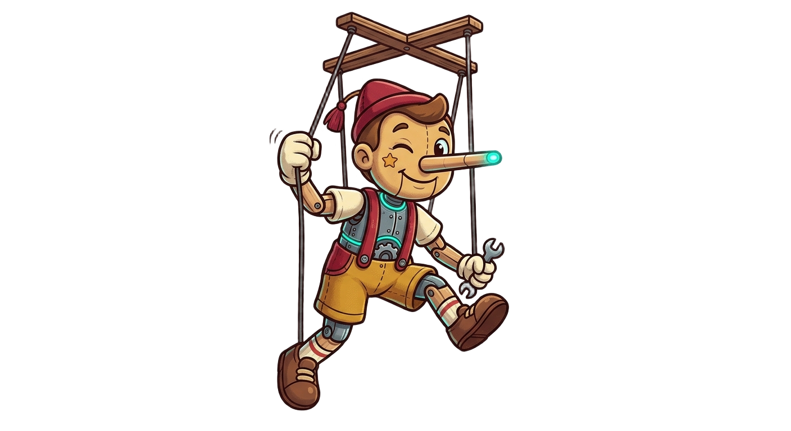
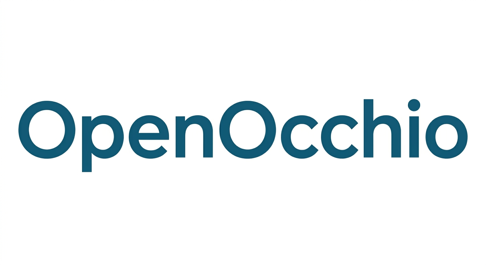
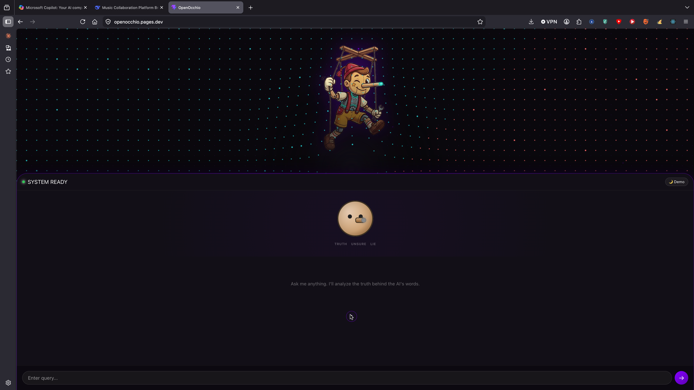
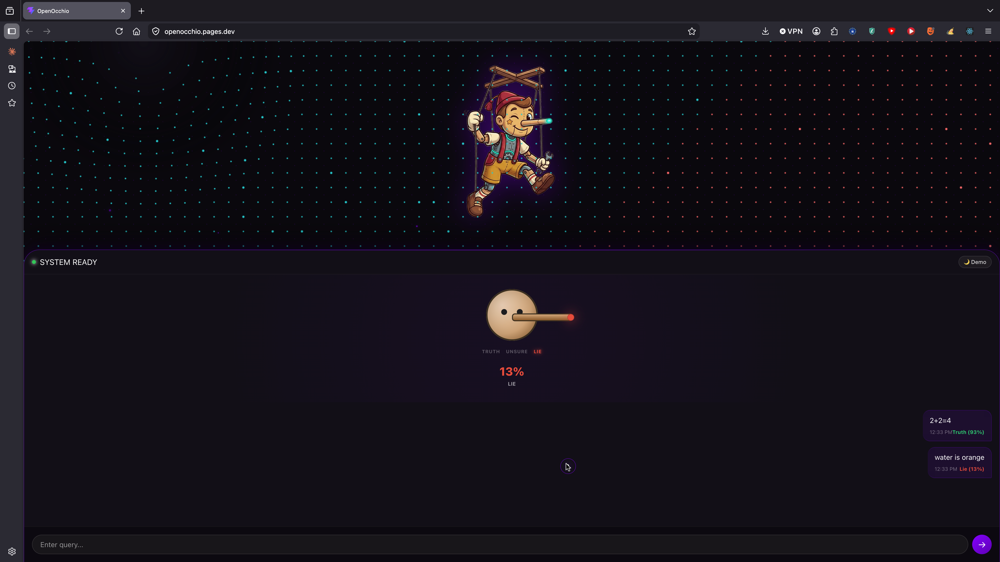
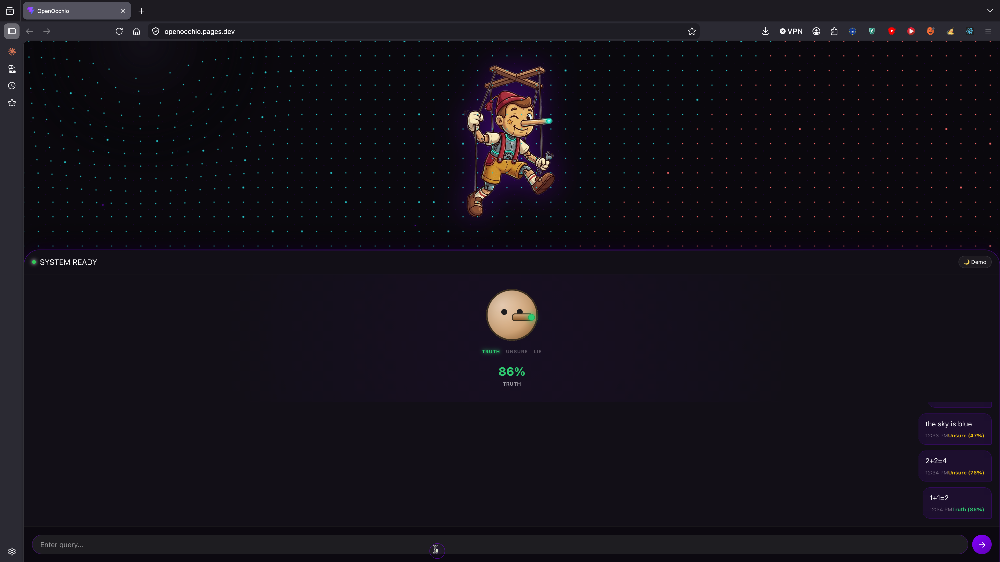

<p align="center">
  
  <br>
  
</p>

# OpenOcchio

**Developed by OpenEdin, a subsidiary of o87Dev Software Engineering.**

**OpenOcchio** is a real-time AI Integrity tool that acts as a "truth-meter" for LLM responses. By intercepting traffic from major AI providers (Claude, ChatGPT, DeepSeek), it calculates a confidence score and visualizes it through a dynamic **Pinocchio's Nose** interface.

---

## 🌐 Live Demo
Experience the OpenOcchio interface directly in your browser:

**[OpenOcchio Live PWA](https://ae5d4d0b.openocchio.pages.dev)**

<p align="center">
  <iframe src="https://ae5d4d0b.openocchio.pages.dev" width="100%" height="600px" style="border: 2px solid #8400ff; border-radius: 20px;"></iframe>
</p>

---

## 📸 Screenshots
### Desktop Overlay & Interface
<p align="center">
  
  <br>
  
  <br>
  
</p>

---

## ✨ Key Features
- **Pinocchio's Nose UI:** A playful, intuitive gauge where "lies" (low confidence) make the nose grow longer and turn red.
- **Onboarding Guide:** New users are greeted with a simple walkthrough that disappears after the first query.
- **Settings & Persistence:** Configure backend URLs and API keys directly in the app. Includes local history for recent confidence checks.
- **Real-time Interception:** Monitors traffic from `claude.ai`, `chat.deepseek.com`, and more using a transparent proxy.
- **Enhanced Heuristics:** Expanded weighted keyword analysis, arithmetic detection, and factual-answer logic.
- **Ollama Judge Backup:** Optional high-quality validation using a local Ollama instance (e.g., Qwen 2.5).
- **Multi-Platform:** Desktop overlay for macOS/Linux and a Mobile-ready PWA (React-based Pro version).

---

## 💻 Desktop Installation & Usage (Recommended)

The desktop version provides the full experience: real-time traffic interception and the floating Pinocchio gauge.

### 1. Prerequisites
- **Python 3.10+**
- **mitmproxy** (`pip install mitmproxy`)
- **PySide6** (`pip install PySide6`)
- **Ollama** (optional, for advanced judging)

### 2. Launch Sequence
OpenOcchio requires two components running in parallel:

**Step A: Start the Pinocchio Overlay**
```bash
python3 confidence_pro/system_overlay.py
```

**Step B: Start the Traffic Interceptor**
```bash
mitmweb --listen-port 8082 -s openocchio_proxy.py
```

**Step C: Configure Browser**
Set your browser (Firefox is easiest) to use a **Manual Proxy Configuration**:
- **HTTP/HTTPS Proxy:** `localhost`
- **Port:** `8082`

Now, whenever you chat with Claude or DeepSeek, the Pinocchio gauge will react instantly to the AI's responses!

---

## 📱 Mobile & Web (PWA)

OpenOcchio can also be deployed as a standalone mobile app using Hugging Face Spaces and Cloudflare Pages.

### 1. Backend Setup
Deploy the `openocchio-backend/` directory as a **Docker Space** on Hugging Face. Add your `GROQ_API_KEY` to the Space secrets.

### 2. Frontend Setup (React Pro)
Update the **Backend URL** in the App Settings (accessible via the ⚙️ icon) and host on Cloudflare Pages.

---

## 📊 Understanding Pinocchio's Nose

The gauge directly visualizes the AI's certainty:
- **Short & Green (0.8 - 1.0):** **Confident.** The AI is assertive and uses certain language.
- **Medium & Yellow (0.4 - 0.79):** **Unsure.** Factual but perhaps slightly hedged or cautious.
- **Long & Red (0.0 - 0.39):** **Lie.** High risk of hallucination or refusal. Pinocchio's nose is at full length!

---
© 2026 OpenEdin / o87Dev Software Engineering
